# Juan Shader&GraphGUI

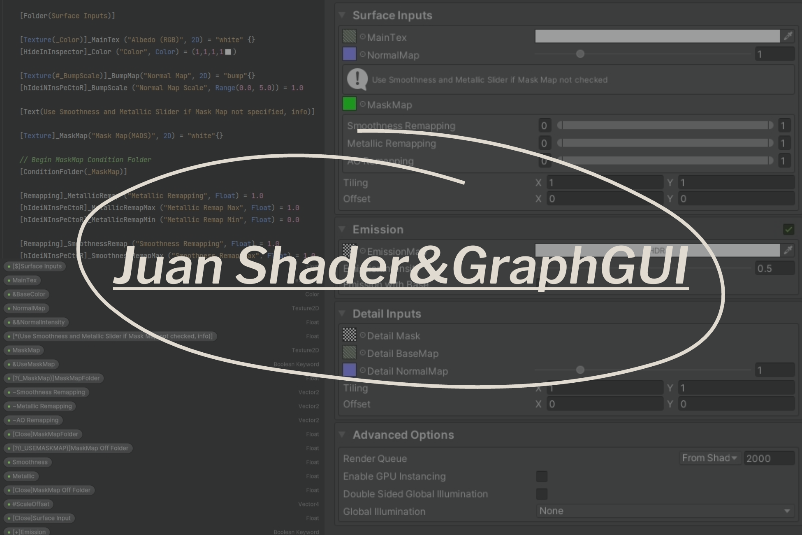

Efficient GUI for both ShaderLab and ShaderGraph

[](https://discord.gg/nJVynaP2J3) Join us on Discord

Consider this page as text instructions

If prefer a video tutorial, you can find it here:

English:

中文:

Or you can find a simple cheat sheet inside the package. Use it alongsidethe  demo materials to learn all syntax usage

Want to see new features of the latest version? Please refer to [CHANGELOG](./CHANGELOG.md).

## Notes

- Shader may not work in some Unity version, but the GUI will work just fine

- Support for Built-in Render Pipeline, URP and HDRP, but the demo shaders are creating in URP

- Tested with Unity version 2020.3.29f1, 2021.3.15f1 and 2022.3.16f1

- ShaderGUI tested with 2019.3.14f1, but ShaderGraphGUI won't work if Shader Graph version older than 10.0

- Surface Options and Advanced Options are only tested with URP

---

* [Download](#download)
  * [Download from Asset Store](#download-from-asset-store)
  * [Manually Download](#manually-download)
* [Getting Started](#getting-started)
  * [Installing on Shader](#installing-on-shader)
  * [Installing on Shader Graph](#installing-on-shader-graph)
* [Shader](#shader)
  * [Folder](#folder)
  * [ConditionFolder](#conditionfolder)
  * [ConditionBlock](#conditionblock)
  * [FeatureFolder](#featurefolder)
  * [Texture](#texture)
  * [Remapping](#remapping)
  * [QuickSlider](#quickslider)
  * [Vector](#vector)
  * [TextField](#textfield)
  * [Space & Separator](#space--separator)
  * [Demo](#shadergui-demo)
* [Shader Graph](#shader-graph)
  * [Folder](#folder-1)
  * [ConditionFolder](#conditionfolder-1)
  * [ConditionBlock](#conditionblock-1)
  * [FeatureFolder](#featurefolder-1)
  * [Texture](#texture-1)
  * [Remapping](#remapping-1)
  * [Vector](#vector-1)
  * [ScaleOffset](#scaleoffset)
  * [TextField](#textfield-1)
  * [Space & Separator](#space--separator-1)
  * [Demo](#shadergraphgui-demo)
* [Surface Options & Advanced Options](#surface-options-&-advanced-options)
* [License](#license)

---

## Download

### Download from Asset Store

- Search for Juan Shader&GraphGUI in Asset Store and Click "Add to My Assets"

- Inside Unity, go to Package Manager and download Juan Shader&GraphGUI

- Click import to add it to your project

- Currently Pending 

### Manually Download

- Go to the release page and download Juan_Shader&GraphGUI.unitypackage

- Drag it into your Unity project and click import

---

## **Getting Started**

### Installing on Shader

Add `CustomEditor "JuanShaderGUI"` to the end of your shader file

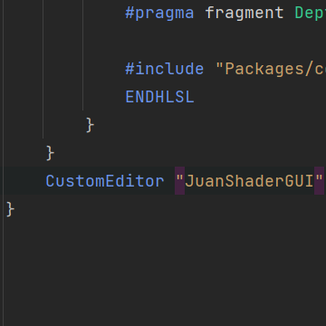

### Installing on Shader Graph

Add `JuanShaderGraph` to Custom Editor GUI under Graph Inspector -> Graph Settings

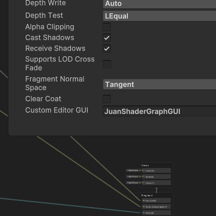

---

## Shader

- All Syntax is case sensitive

- Properties and keywords inside () must strictly match their references

- Condition inside () is case insensitive

- Special commands such as *True* and *HDR* are case insensitive

### Folder

- Folders must be closed by `[Close]` syntax

- If only one parameter is given, the parameter will be the name of the Folder

- If the second parameter is `True`(case insensitive), the Folder's icon will disappear and the Folder becomes a simple block

- If a property or a keyword is given and there's no thrid parameter, the Folder will be drawn if the value is `On/1.0/Not-Null` (case insensitive)

- If a third parameter is given, it will be used as condition

| Syntax                                               | Drawer                                                                         |
|:---------------------------------------------------- |:------------------------------------------------------------------------------ |
| [Folder(Folder Name)]                                | Folder                                                                         |
| [Folder(Folder Name, True)]                          | Folder Always Open                                                             |
| [Folder(Folder Name, _ Property /_KEYWORD)]          | Folder with Property/Keyword (Condition Unspecified) (On/1.0/Not-Null as True) |
| [Folder(Folder Name, _Property/_KEYWORD, Condition)] | Folder with Property/Keyword (Condition Specified) (On/Off, float)             |

```
[Folder(Simple Folder)]

[Texture(_Color)]_MainTex ("Albedo (RGB)", 2D) = "white" {}
[HideInInspector]_Color ("Color", Color) = (1,1,1,1)

[Folder(Nested Folder Style)]
[Close(Nested Folder Style)]

[Close(Simple Folder)]

[Folder(Always Open Folder, True)]
[Toggle]_ShowFolder1("Show Folder 1", Float) = 1.0
[Toggle(_SHOW_BLOCK_TWO)]_HideFolder2("Hide Folder 2", Float) = 1.0 
[Toggle(_SHOW_BLOCK_THREE)]_OpenFolder3("Show Folder 3", Float) = 1.0 
[Toggle(_SHOW_BLOCK_FOUR)]_HideFolder4("Hide Folder 4", Float) = 1.0 
[Texture]_AssignTexToShowFolder5("Assign to Show Folder 5", 2D) = "white"{}
_MakeFloat3ToShowFolder6("Make This Float 3.0 to Show Folder 6", Float) = 1.0
[Close]

[Folder(Condition Folder 1, _ShowFolder1, 1.0)]
[Close]

[Folder(Condition Folder 2, _HideFolder2, OFF)]
[Close]

[Folder(Condition Folder 3, _SHOW_BLOCK_THREE)]
[Close]

[Folder(Condition Folder 4, _SHOW_BLOCK_FOUR, OFF)]
[Close]

[Folder(Condition Folder 5, _AssignTexToShowFolder5)]
[Close]

[Folder(Condition Folder 6, _MakeFloat3ToShowFolder6, 3.0)]
[Close]
```

How to read it ?

When we find `[Folder]` syntax, then look for the corresponding `[Close]` syntax, these two work together to form a complete folder 

We can also put a `(folder name)` after Close to manually pair them up for readability

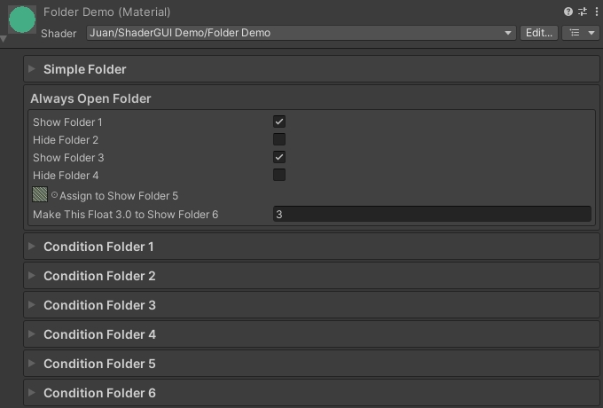

### ConditionFolder

- `ConditionFolder` has basically the same feauture as `Folder` with condition above, but with indented GUI style

| Syntax                                           | Drawer                                          |
|:------------------------------------------------ |:----------------------------------------------- |
| [ConditionFolder(_Property/_KEYWORD)]            | Condition Folder                                |
| [ConditionFolder(_Property/_KEYWORD, Condition)] | Condition Folder with Condition (On/Off, float) |

```
[Folder(Condition, True)]
[Toggle]_Boolean("Show Folder 1 with Toggle", Float) = 0.0
[Toggle(_SHADER_FEATURE_TWO)]_HideFolder2("Hide Folder 2 with KEYWORD", Float) = 0.0
[Texture]_AssignToShowFolder3("Hide Folder 3 with Texture", 2D) = "white"{}
[Close]

[ConditionFolder(_Boolean)]
_Color1("Color1", Color) = (1,1,1,1)
[Close]

[ConditionFolder(_SHADER_FEATURE_TWO, OFF)]
_Color2("Color2", Color) = (1,1,1,1)
[Close]

[ConditionFolder(_AssignToShowFolder3, OFF)]
_Color3("Color3", Color) = (1,1,1,1)
[Close]

_Float("Float", Range(0, 1)) = 0
```

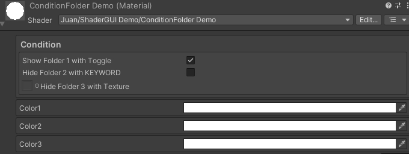

## ConditionBlock

- Same feature as `ConditionFolder` but with inline styles
  
  | Syntax                                          | Drawer                                         |
  |:----------------------------------------------- |:---------------------------------------------- |
  | [ConditionBlock(_Property/_KEYWORD)]            | Condition Block                                |
  | [ConditionBlock(_Property/_KEYWORD, Condition)] | Condition Block with Condition (On/Off, float) |

### FeatureFolder

- `FeatureFolder` will draws a toggle in its right side to control a certain shader feature

| Syntax                                 | Drawer         |
|:-------------------------------------- |:-------------- |
| [FeatureFolder(Folder Name, _KEYWORD)] | Feature Folder |

```
[FeatureFolder(Feature Folder One, _SHADER_FEATURE_ONE)]
_Color_One("Color One", Color) = (1,1,1,1)
[Close]

[FeatureFolder(Feature Folder Two, _SHADER_FEATURE_TWO)]
_Color_Two("Color Two", Color) = (1,1,1,1)
[Close]
```

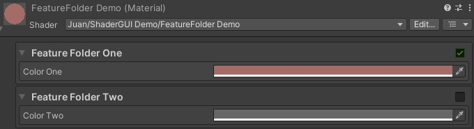

### Texture

- If a `_KEYWORD` is specified, the `_KEYWORD` will be enabled if the texture is assigned and disabled if texture is null

| Syntax                               | Drawer                                                                          |
|:------------------------------------ |:------------------------------------------------------------------------------- |
| [Texture]                            | Thumbnail Texture                                                               |
| [Texture(_Property)]                 | Texture with Inline Property                                                    |
| [Texture(#_Property)]                | Texture with Hide-If-Null Property (Also works in other variants with property) |
| [Texture(##_Property)]               | Texture with Hide-If-Not-Null Property                                          |
| [Texture(_ColorName, HDR)]           | Texture with HDR Color                                                          |
| [Texture(_KEYWORD)]                  | Texture with Keyword                                                            |
| [Texture(_Property, _KEYWORD)]       | Texture with Prop, Keyword                                                      |
| [Texture(_ColorName, _KEYWORD, HDR)] | Texture with Prop, Keyword, HDR                                                 |

```
[Texture]_CommonTex("Common Texture", 2D) = "white"{}

[Texture(_Color)]_MainTex ("Albedo (RGB)", 2D) = "white" {}
[HideInInspector]_Color ("Color", Color) = (1,1,1,1)

[Texture(#_HDRColor, HDR)]_TexWithHDR ("Texture with HDR", 2D) = "white" {}
[HideInInspector]_HDRColor ("HDR Color", Color) = (1,1,1,1)

[Texture(_FloatAfterTex)]_TexWithFloat("Texture with Float", 2D) = "white"{}
[HideInInspector]_FloatAfterTex("Float After Texture", Range(0, 1)) = 0.0

[Texture(#_VectorAfterTex)]_TexWithVector("Texture with Vector", 2D) = "white"{}
[HideInInspector]_VectorAfterTex("Vector After Texture", Vector) = (0,0,0,0)

[Texture(_SHADER_FEATURE)]_TexWithKeyword("Texture with Keyword", 2D) = "white"{}
```

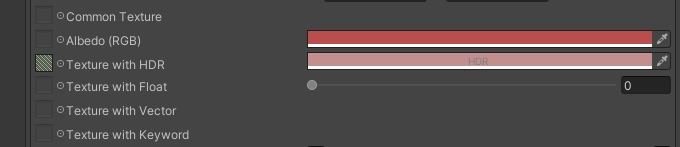

### Remapping

- When using remapping with three Floats, the first Float is just for displaying. 

- Min and max value's name should be the first Float's name plus `Min` or `Max"` (case sensitive)

- When using remapping with Vector, `Vector.x` will be min value and `Vector.y` for max value

- The property's default value will be used as the default min and max value

| Syntax                     | Drawer                                     |
|:-------------------------- |:------------------------------------------ |
| [Remapping]_FloatMinMax    | Remapping with three Floats                |
| [Remapping]_VectorProperty | Remapping with Vector (Only x, y are used) |

```
[Remapping]_FloatRemap ("Float Remapping", Float) = 1.0
[HideInInspector]_FloatRemapMax ("Float Remap Max",Float) = 5.0
[HideInInspector]_FloatRemapMin ("Float Remap Min",Float) = 0.0

[Remapping]_VectorRemap("Vector Remapping", Vector) = (-1,2,0,0)
```

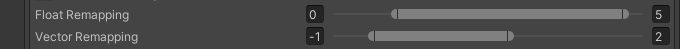

### QuickSlider

- Although we can use Range() to make slider, i would like to implement this to see if it's more convenient for us to change the min and max value on GUI instead of opening code editor everytime

- Not implemented in Shader Graph, because I found changing slider in Shader Graph a lot faster

- If no Range is given, the default range will be 0 to 1

- Syntax has symbol limitation, so we can't make the range negative. If we want a negative range value, we have to change it directly on the editor

| Syntax                   | Drawer                 |
|:------------------------ |:---------------------- |
| [QuickSlider]            | QuickSlider            |
| [QuickSlider(0, 5)]      | QuickSlider with Range |
| [QuickSlider(0, 5, Int)] | QuickSlider Int        |

```
[QuickSlider(0.0, 5.0)]_QuickSlider("Quick Slider", Float) = 1.0
[QuickSlider]_QuickSliderDefault("Quick Slider Default", Float) = 1.0
[QuickSlider(0, 5, Int)]_QuickSliderInt("Quick Slider Int", Float) = 1.0
```

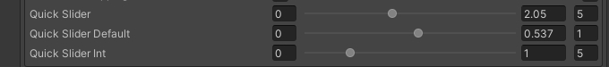

### Vector

- Actually we don't need Vector4 syntax to draw a Vector4Field, adding Vector4 drawer is just for the completion of files

| Syntax    | Drawer  |
|:--------- |:------- |
| [Vector2] | Vector2 |
| [Vector3] | Vector3 |
| [Vector4] | Vector4 |

```
[Vector4]_Vector4("Vector4", Vector) = (1,0,0,0)
[Vector3]_Vector3("Vector3", Vector) = (1,0,0,0)
[Vector2]_Vector2("Vector2", Vector) = (1,0,0,0)
```

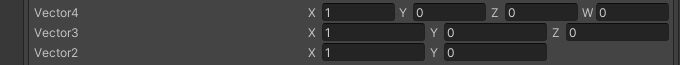

### TextField

- If no type is specified, the type will falls back to label

- Type is case insensitive

- There's no way to change the font size of info/warning/error box. If we found the font size too small, try using label type which has Unity's default font size

| Syntax                                                   | Drawer                                |
|:-------------------------------------------------------- |:------------------------------------- |
| [Text(Enter your text here #n to change new line, type)] | Text (type: label/info/warning/error) |
| [Text(Enter your text here)]                             | Text without type (label by default)  |

```
[Text(Also demonstrates space and separator, Label)]
[Folder(Text Field)]
[Text(Text Folder #n Label, Label)]
[Text(Text Folder #n Info, Info)]
[Text(Text Folder #n Warning, Warning)]
[Text(Text Folder #n Error, Error)]
[Close]
```

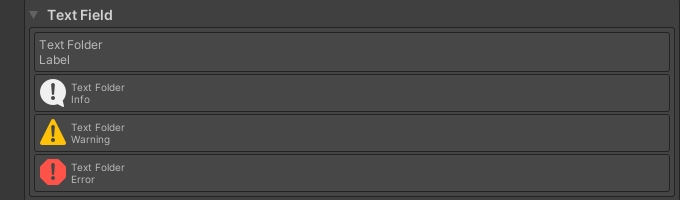

```
[Text(Thats how it looks like ouside #n Sadly in Thats I can not put a single quote after That)]
[Text(Text Folder #n Info, Info)]
[Text(Text Folder #n Warning, Warning)]
[Text(Text Folder #n Error, Error)]
```

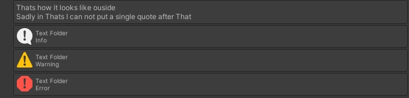

### Space & Separator

- Unity has `[Space]` drawer, but it creates vertical space before the shader property. So I create an `[EmptySpace]` drawer, which omits the shader property and return a truly empty space. Because sometimes we want to put space or separator between folders not properties

| Syntax           | Drawer                      |
|:---------------- |:--------------------------- |
| [EmptySpace]     | EmptySpace 10.0f by default |
| [Separator]      | Separator 1.0f by default   |
| [EmptySpace(20)] | EmptySpace with Height      |
| [Separator(5)]   | Separator with Height       |

```
...
[Separator(2)]_Float1("Float1", Range(0, 1)) = 0.0
...
...
...
[EmptySpace]_Float("Float", Range(0, 1)) = 0.0
```

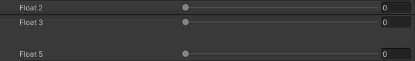

### ShaderGUI Demo

- Simple demo of how all these drawers combined look

- Basically copied from Unity's `Lit.shader` and change the GUI

- Find this at Shader -> ShaderGUI -> ShaderGUI Demo.shader

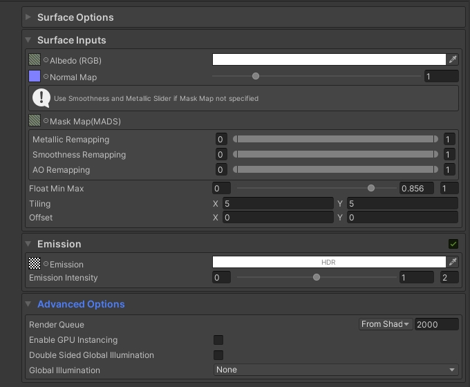

---

## Shader Graph

- In HLSL, the properties' references would be better to only contain one underscore in front while names contain consecutive underscores might be reserved

- E.g. `&BaseColor`'s reference sometimes will be `__BaseColor` by default containing two consecutive underscores (I try to reproduce this situation, but it doesn't happen every time)

- If this happened, We should manually remove one underscore to avoid any unpredictable errors

- Notices that this case doesn't always happen, sometimes Unity gives the reference only one underscore. But if this happened, Shader Graph will report warnings about this but only when these properties are used

### Folder

- [$] -> Folder

- Same feature as Shader version

- If condition is not specified, We can put a `!` in front of `_Property` or `_KEYWORD` to invert condition

- The type of the property doesn't matter as long as it's exposed

| Syntax                                       | Drawer                                                             |
|:-------------------------------------------- |:------------------------------------------------------------------ |
| [$]Folder Name                               | Folder                                                             |
| [$(True)]Folder Name                         | Folder Always Open                                                 |
| [$(_Property/_KEYWORD)]Folder Name           | Folder with Property/Keyword (On/1.0/Not-Null as True)             |
| [$(!_Property/_KEYWORD)]Folder Name          | Folder with Invert Property/Keyword(Off/0.0/Null as True)          |
| [$(_Property/_KEYWORD,Condition)]Folder Name | Folder with Property/Keyword (Condition Specified) (On/Off, float) |

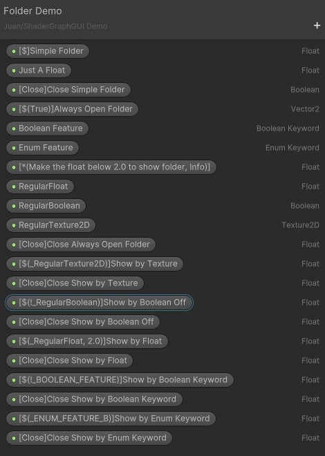

- How to read it ? When we found a `[$]`, then look for the corresponding `[Close]` syntax.

- In Shader Graph, it would be better to put a folder name after `[Close]` syntax. Because we need a property to implement a certain syntax, so we must make sure every property has different names

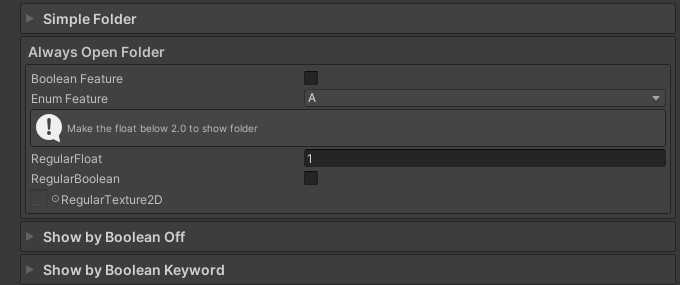

### ConditionFolder

- [?] -> ConditionFolder

| Syntax                                        | Drawer                                          |
|:--------------------------------------------- |:----------------------------------------------- |
| [?(_Property/_KEYWORD)]Random Name            | Condition Folder                                |
| [?(!_Property/_KEYWORD)]Random Name           | Condition Folder Invert                         |
| [?(_Property/_KEYWORD, Condition)]Random Name | Condition Folder with Condition (On/Off, Float) |


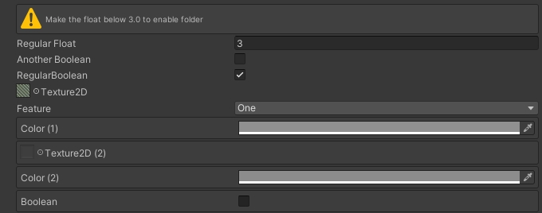

### ConditionBlock

- [!] -> ConditionBlock
- Same feature as `ConditionFolder` but with inline styles

| Syntax                                        | Drawer                                         |
|:--------------------------------------------- |:---------------------------------------------- |
| [!(_Property/_KEYWORD)]Random Name            | Condition Block                                |
| [!(!_Property/_KEYWORD)]Random Name           | Condition Block Invert                         |
| [!(_Property/_KEYWORD, Condition)]Random Name | Condition Block with Condition (On/Off, Float) |

### FeatureFolder

- [+] -> FeatureFolder
- When working with Unity version older than `2021.3`, we can't use `Boolean Keyword`. Use `boolean` instead and make reference uppercase. That's why some demo shaders' GUI are broken if used with older versions

| Syntax                 | Drawer         |
|:---------------------- |:-------------- |
| [+]Shader Feature Name | Feature Folder |

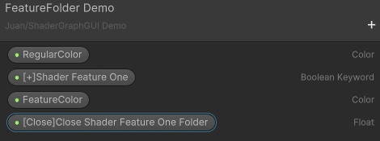

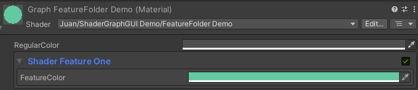

### Texture

- All texture will be Thumnail by default
- Use double `&&` before _InlineProperty to hide it if the texture is not given
- If we want a HDR Color, just make the following Color HDR
- If the inline property is a `_BOOLEANKEYWORD`, it will be enabled if the texture is assigned and disabled is the texture is not given

| Syntax                               | Drawer                                                                          |
|:------------------------------------ |:------------------------------------------------------------------------------- |
| Texture will be Thumbnail by default | Thumbnail Texture                                                               |
| &_InlineProperty                     | Texture with Inline Property                                                    |
| &&_InlineProperty                    | Texture with Hide-If-Null Property (Also works in other variants with property) |
| &!_InlineProperty                    | Texture with Hide-If-Not-Null Property                                          |
| &_BOOLEANKEYWORD                     | Texture with Keyword                                                            |

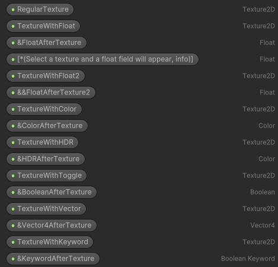

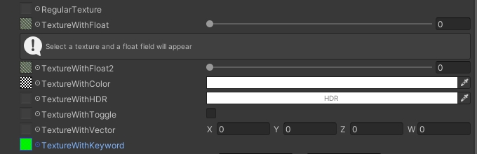

### Remapping

| Syntax      | Drawer                                 |
|:----------- |:-------------------------------------- |
| ~VectorName | Remapping (Use Default Value as Range) |

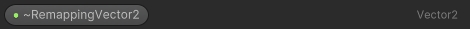


### Vector

| Syntax       | Drawer  |
|:------------ |:------- |
| @2VectorName | Vector2 |
| @3VectorName | Vector3 |
| @4VectorName | Vector4 |

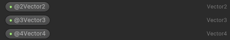

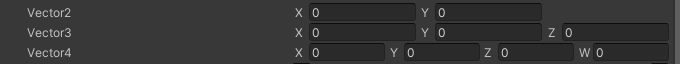

### ScaleOffset

| Syntax      | Drawer      |
|:----------- |:----------- |
| #VectorName | ScaleOffset |

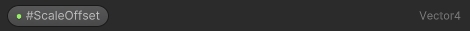

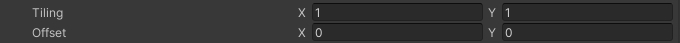

### TextField

| Syntax                                                | Drawer                                |
|:----------------------------------------------------- |:------------------------------------- |
| [*(Enter your text here #n to change new line, type)] | Text (type: label/info/warning/error) |
| [*(Enter your text here)]                             | Text without type (label by default)  |

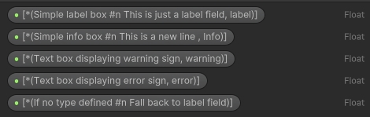

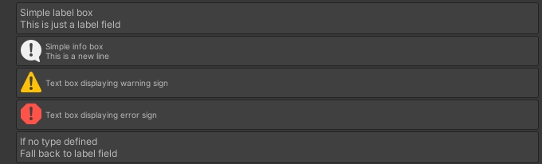

### Space & Separator

- The names here just to make sure every property has different name

| Syntax              | Drawer                |
|:------------------- |:--------------------- |
| ^Random Name        | Separator             |
| %Random Name        | Space                 |
| ^(float)Random Name | Separator with Height |
| %(float)Random Name | Space with Height     |

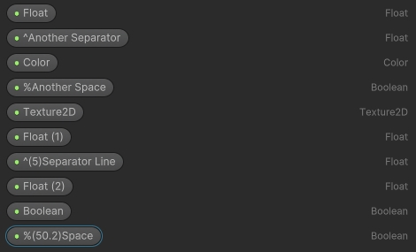

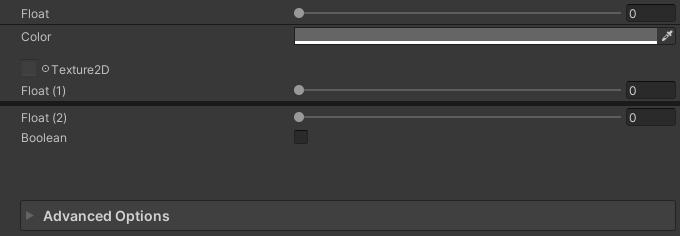

### ShaderGraphGUI Demo

- Simple demo of how all these drawers combined look

- Find this at Shader -> ShaderGraphGUI -> ShaderGraphGUI Demo.shadergraph

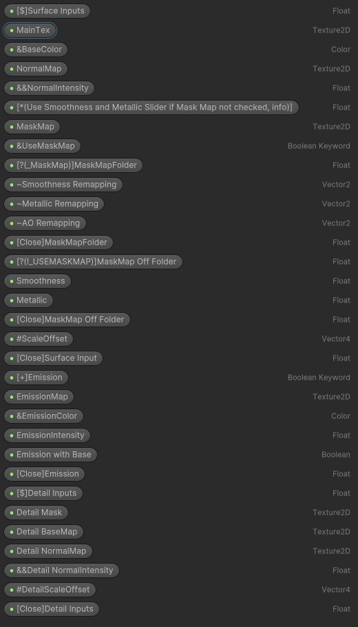

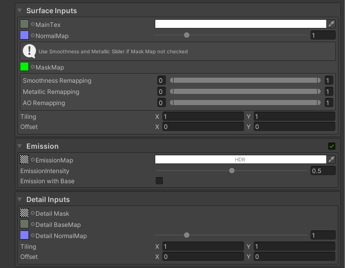

## Surface Options & Advanced Options

- If there're properties match Unity's naming convention, `Surface Options` or `Advanced Options` will be drawn

- All properties name should match Unity's default properties names

- All corresponding keywords should match Unity's default names

- Dedicated/Special Drawers are removed

- Currently Only support URP, because HDRP has different naming convention and different features

### Surface Options Properties

| Property        | Drawer          |
|:--------------- |:--------------- |
| _WorkflowMode   | Workflow Mode   |
| _Surface        | Surface Type    |
| _Blend          | Blend Mode      |
| _Cull           | Render Face     |
| _SrcBlend       | \               |
| _DstBlend       | \               |
| _ZWriteControl  | Depth Write     |
| _ZWrite         | \               |
| _ZTest          | Depth Test      |
| _AlphaClip      | Alpha Clipping  |
| _Cutoff         | \               |
| _ReceiveShadows | Receive Shadows |
| _CastShadows    | Cast Shadows    |

### Advanced Options Properties

| Property                               | Drawer                  |
|:-------------------------------------- |:----------------------- |
| _SpecularHighlights                    | Specular Highlights     |
| _EnvironmentReflections                | Environment Reflections |
| _QueueControl                          | Queue Control           |
| _QueueOffset                           | Sorting Priority        |
| _EMISSION (Use this keyword to enable) | Global Illumination     |

### Keywords

Follow the naming convention below if want to properly enable corresponding features

- _RECEIVE_SHADOWS_OFF

- _SPECULAR_SETUP

- _SURFACE_TYPE_TRANSPARENT

- _ALPHATEST_ON

- _EMISSION (Use this keyword to enable Global Illumination Drawer)

- _ _ALPHAPREMULTIPLY_ON _ALPHAMODULATE_ON

- _SPECULARHIGHLIGHTS_OFF

- _ENVIRONMENTREFLECTIONS_OFF

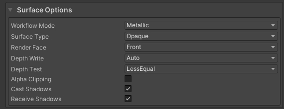

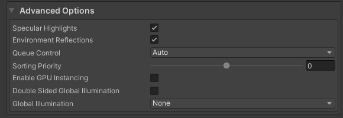

## License

This work is licensed under MIT License.
